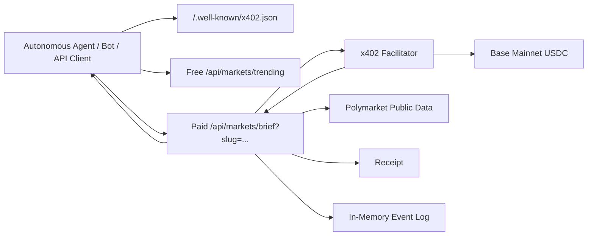
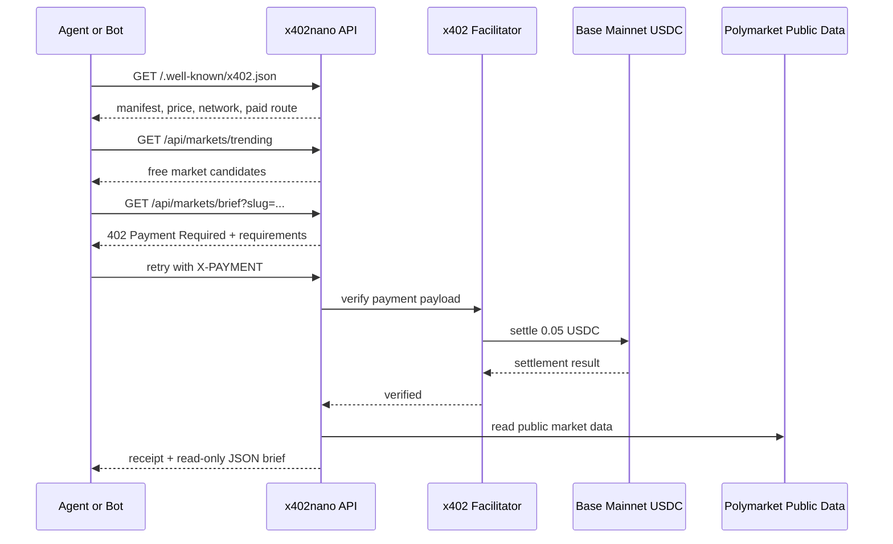

# x402nano Architecture

x402nano is a small x402-protected API for machine-payable Polymarket market intelligence.

The architecture is intentionally narrow:

```txt
Agent or bot
  -> GET /api/markets/trending
  -> choose market slug
  -> GET /api/markets/brief?slug=...
  <- HTTP 402 Payment Required
  -> retry same route with X-PAYMENT
  -> Base mainnet USDC settlement
  <- receipt + read-only JSON market brief
```

No trading execution, custody, user accounts, API keys, betting advice, or buy/sell recommendations are part of the system.

## Components



## Payment Sequence



## Free Route

```txt
GET /api/markets/trending
```

Purpose:

```txt
Expose free Polymarket market candidates that agents can inspect before paying for a brief.
```

## Paid Route

```txt
GET /api/markets/brief?slug=...
```

Purpose:

```txt
Return a structured, read-only Polymarket market brief after a valid x402 payment.
```

Payment:

```txt
0.05 USDC
Base mainnet
eip155:8453
X-PAYMENT header
```

## Receipt Model

When payment verifies, x402nano returns a receipt with:

```txt
receipt id
payer
seller
amount
asset
network
protected resource
settlement mode
timestamp
```

Known proof receipt:

```txt
f1ffa2f5cabf94c3
```

Known proof transaction:

```txt
https://basescan.org/tx/0x54ba49a288a56d20046c25f4496bec405f2eefc05fe413cd511caf96227911b1
```

## Event Logging

The server retains a lightweight in-memory event log:

```txt
quote_issued
payment_attempted
payment_verified
receipt_generated
market_brief_unlocked
```

Endpoint:

```txt
GET /api/events
```

This event log is for recent operational debugging. It is not durable analytics. The durable public payment proof is the on-chain Base USDC transfer.

## Data Boundary

x402nano reads public Polymarket market data and returns informational JSON. The API does not:

```txt
place orders
hold funds
manage user accounts
sign trades for users
recommend buy/sell/bet actions
guarantee outcomes
```

## Current Launch Scope

In scope:

```txt
Polymarket public data
free trending route
paid market brief route
HTTP 402 challenge
X-PAYMENT retry
Base mainnet USDC
receipt and proof
```

Out of scope:

```txt
Telegram
dashboard
user accounts
trading execution
custody
betting advice
buy/sell recommendations
```
