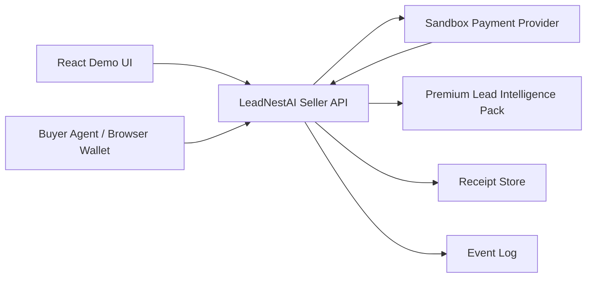
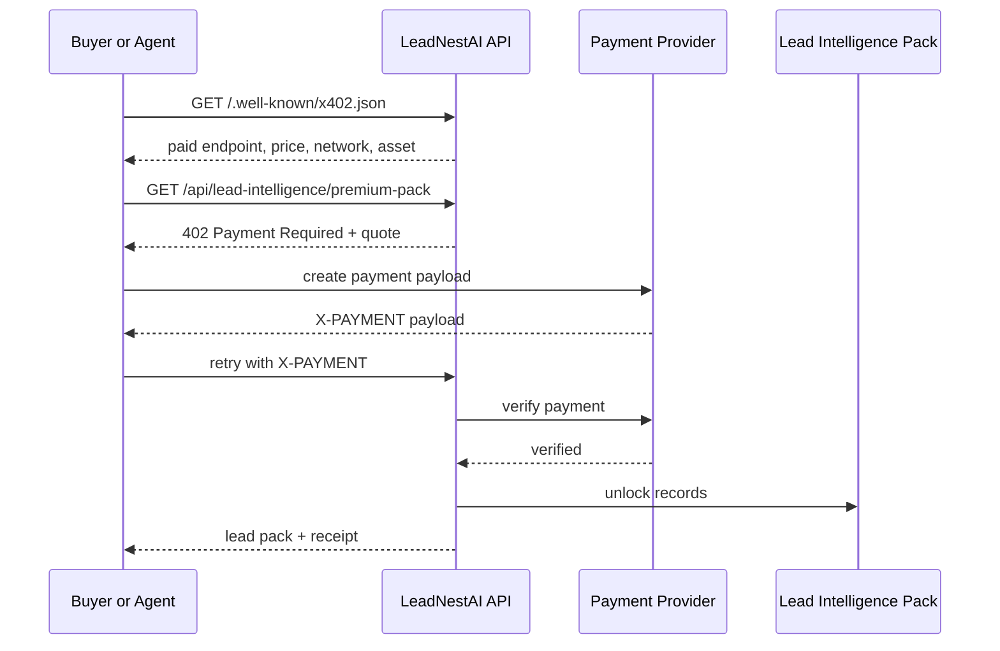
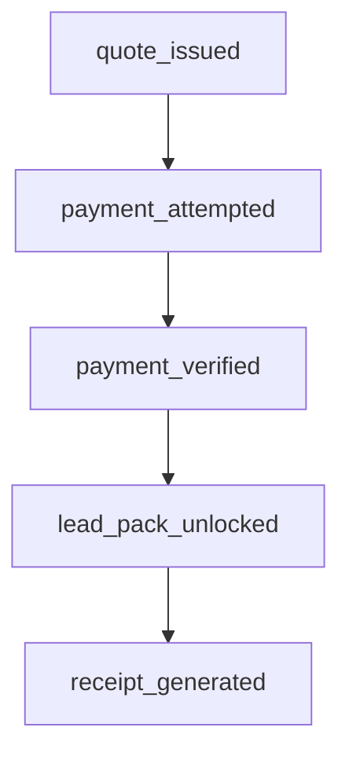

# LeadNestAI Machine-Payable API Architecture

## Purpose

This project is a commercial proof-of-concept for LeadNestAI as a machine-payable lead intelligence API.

LeadNestAI is the commercial front. The x402-style payment flow is the infrastructure advantage underneath it.

## Core Components



## Buyer Flow

1. Buyer or agent discovers the API through `/.well-known/x402.json`.
2. Buyer requests `/api/lead-intelligence/premium-pack`.
3. Seller returns `402 Payment Required` with payment requirements.
4. Buyer creates a payment payload.
5. Buyer retries the same endpoint with `X-PAYMENT`.
6. Seller verifies payment.
7. Seller returns a LeadNestAI premium lead intelligence pack and receipt.



## Seller Flow

1. Publish a discovery manifest.
2. Quote price, network, asset, seller wallet, resource, and nonce.
3. Track issued quotes.
4. Reject unpaid access.
5. Verify payment payloads.
6. Prevent replayed nonces.
7. Generate receipts.
8. Log quote, payment, unlock, and receipt events.



## Receipt Flow

When payment verifies, the server creates a receipt containing:

- receipt id
- payer
- seller
- amount
- asset
- network
- protected resource
- settlement mode
- transaction reference
- timestamp

Receipts are available through:

```txt
/api/receipts/{receiptId}
```

## Event Logging

The server keeps a lightweight in-memory event log for future metering:

- `quote_issued`
- `payment_attempted`
- `payment_verified`
- `lead_pack_unlocked`
- `receipt_generated`

The current event endpoint is:

```txt
/api/events
```

This is a structure for future usage metering, analytics, billing records, and operational debugging. It is not a production database yet.

## Settlement Modes

### Sandbox Mode

```txt
X402_PAYMENT_MODE=sandbox
```

Sandbox mode keeps the demo safe:

- no real funds move
- sandbox signer creates payment payloads
- browser wallet signs an authorization message
- receipt proves the access flow

### Future Facilitator Mode

```txt
X402_PAYMENT_MODE=facilitator
```

Facilitator mode will disable the sandbox signer and expect a real x402 payment payload in `X-PAYMENT`.

Do not enable facilitator mode until `REAL_SETTLEMENT_DRY_RUN.md` is followed.

## Current Product Shape

The protected commercial resource is:

```txt
/api/lead-intelligence/premium-pack
```

It returns structured lead intelligence:

- business name
- industry
- location
- estimated job value
- buying intent
- pain points
- recommended opener
- confidence score

## Future Autonomous Agent Use Case

An autonomous buyer agent can:

1. discover LeadNestAI
2. inspect price and schema
3. decide whether the lead pack is worth buying
4. pay automatically
5. unlock the lead intelligence
6. use the recommended opener in an outreach workflow
7. repeat without human checkout

That is the long-term infrastructure direction.
