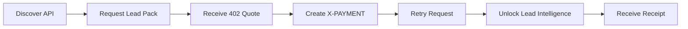
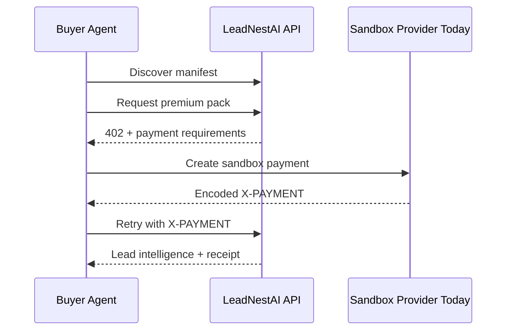

# LeadNestAI Payment Flow

This document explains the one polished workflow this demo is built around.



## Protected Resource

```txt
GET /api/lead-intelligence/premium-pack
```

This endpoint returns a premium LeadNestAI lead intelligence pack only after payment verification.

## Step 1. Discover

Buyer calls:

```txt
GET /.well-known/x402.json
```

The manifest returns:

- paid endpoint
- price
- asset
- network
- seller wallet
- payment header
- schema link
- sandbox signer link when in sandbox mode

## Step 2. Request Without Payment

Buyer calls:

```txt
GET /api/lead-intelligence/premium-pack
```

Seller returns:

```txt
402 Payment Required
```

The response includes payment requirements:

- amount
- asset
- network
- seller wallet
- resource
- nonce
- expiration

## Step 3. Create Payment Payload

In sandbox mode, the buyer can call:

```txt
POST /api/payments/sign
```

This returns an encoded payment payload for demo use.

In future facilitator mode, the buyer wallet or x402 client creates the real payment payload.

## Step 4. Retry With X-PAYMENT

Buyer retries:

```txt
GET /api/lead-intelligence/premium-pack
X-PAYMENT: <encoded-payment-payload>
```

The seller verifies:

- payload structure
- quote nonce
- resource
- amount
- asset
- network
- seller address
- expiration
- replay status

## Step 5. Unlock Lead Intelligence

If verification passes, the seller returns:

```txt
200 OK
```

Response includes:

- receipt
- premium lead intelligence records
- payment response headers

## Step 6. Receipt

The receipt proves the unlock event:

- payer
- seller
- amount
- asset
- network
- settlement mode
- timestamp
- transaction reference

In sandbox mode, this proves the demo flow. In facilitator mode, this will point to real settlement data returned by the facilitator.

## Current Settlement Status

Current public demo:

```txt
payment mode: sandbox
settlement: sandbox-simulated
real funds: no
```

That is intentional.

## Verification Commands

```powershell
npm.cmd run settlement:check
$env:AGENT_API_ORIGIN="https://x402nano.onrender.com"
npm.cmd run smoke
npm.cmd run demo:record
```

## What This Proves

The payment flow proves that LeadNestAI can become a machine-payable API:



It does not claim real settlement until the facilitator dry run passes.
